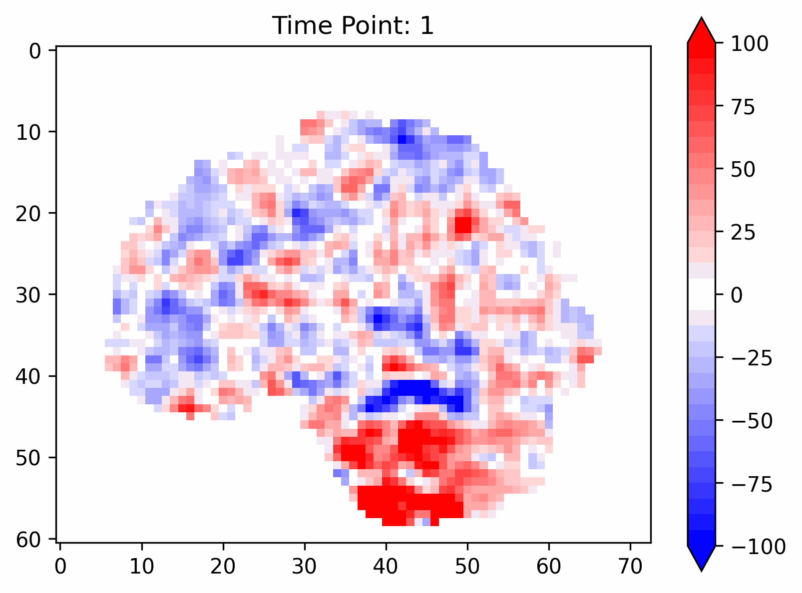

# fMRI-LDM: Enabling Feature Enhancement and Classification in Autism Spectrum Disorders Using Latent Diffusion Model
A latent diffusion model applied to fMRI.

# Overview

This work introduces the fMRI latent diffusion model (fMRI-LDM), the first framework to apply diffusion models to the generation and analysis of 4D fMRI data. The model is designed to capture and model the inter-group differences between individuals with autism spectrum disorder (ASD) and healthy controls (HC). fMRI-LDM consists of two main components: Volume-VAE and Volumes-LDM. Experimental results show that fMRI-LDM holds promising potential in feature augmentation, classification, and generation tasks.

# Catalogues

1. [Introduction](#introduction)
2. [Method](#method)
3. [Results](#results)
4. [How to use](#how-to-use)

# Introduction

The integration of functional magnetic resonance imaging (fMRI) with deep learning (DL) techniques has become a prominent research direction, particularly with the widespread application of DL in classification tasks based on fMRI data. However, the accuracy faces significant bottlenecks in classification tasks for autism spectrum disorders (ASD) and healthy controls (HC). The primary limitation is that the dimensionality reduction of fMRI data inevitably results in the loss of critical high-dimensional information, which hampers the ability of DL models to capture the necessary features for accurate classification. To address this limitation, we propose an innovative generative DL framework—fMRI Latent Diffusion Model (fMRI-LDM). This model is designed to voxel-wise model the distribution of the four-dimensional BOLD signals, achieving feature enhancement, classification, and generation. The fMRI-LDM consists of two key components: an autoencoder and a latent diffusion model. The autoencoder component introduces a Volume-VAE, which learns the spatial information of each volume and performs fine-grained modeling. In the diffusion model component, we propose a Volumes-LDM that captures the dynamic dependencies between volumes. Experimental results on the ABIDE dataset demonstrate that fMRI-LDM effectively enhances the distinguishing features between ASD and HC, significantly improving classification performance. Moreover, fMRI-LDM exhibits powerful in-place generation capabilities, enabling the controlled generation of fMRI data for specified ASD or HC groups based on textual input, thereby exploring subtle differences in neural activity patterns associated with ASD. fMRI-LDM holds promise as a new direction for fMRI image enhancement and its application in assisting ASD diagnosis.

# Method

## Volume-VAE

The proposed Volume Variational Autoencoder (Volume-VAE) model is designed to learn the mapping of each fMRI volume X to a latent space Z. The Volume-VAE consists of two main components: an encoder and a decoder. The innovation of Volume-VAE lies in its ability to compute the latent representation of fMRI data from multiple perspectives, including the coronal, sagittal, and axial planes, simultaneously. This multi-view approach effectively captures the fine-grained spatial characteristics of the data, enabling a more comprehensive and robust modeling of brain activity patterns.

## Volumes-LDM

The proposed fMRI-LDM model addresses the challenge of time series modeling using fMRI data. Specifically, the latent diffusion model generates the latent space features of consecutive volumes, learning the temporal dependencies between them. By incorporating a Cross Attention mechanism, the model conditions on pathological information (e.g., ASD) and injects this information into the denoising process. The goal is to guide the model to focus more on pathology-relevant features during the generation process, enhancing the model’s ability to capture the subtle temporal and pathological characteristics inherent in the fMRI data.

# Results

See our paper for details

# How to use

This code has been tested on Ubuntu 20.04 and an NVIDIA RTX A6000 GPU. Furthermore it was developed using Python v3.9.

## Setup

In order to run our model, we suggest you create a virtual environment
```
conda create -n fmriLDM python=3.8
```
and activate it with 
```
conda activate fmriLDM
```
Subsequently, download and install the required libraries by running 
```
pip install -r requirements.txt
```


## Prepare datasets

The data used in this word were sourced from the Autism Brain Imaging Data Exchange ([ABIDE](https://fcon_1000.projects.nitrc.org/indi/abide/)). And we downloaded the pre-processed fMRI data from ABIDE, which was processed using the CPAC pipeline.

Once the dataset is downloaded, you need to use a script that scans the dataset and saves the information in a dictionary file (.json).

```
python scripts/generate_json_file.py
```

You need to change the data storage address and the phenotype file address. If you are using other datasets or your own data, modify the script as needed. Also, I have given the json file I am using as an example in /datas.


## Training

Once all libraries are installed and the datasets have been downloaded, you are ready to train the model.

### 1. Train autoencoder part

You can run the file train_VAE.py directly, or use the following command:

```
python train_VAE.py --epochs 40 --lr 0.00001 --batch_size 8 --accelerate 2 --eval_step 3 --early_stop 10
```

We trained 400 epochs in such configuration.

### 2. Generate the latent space patterns

It is well known that potential diffusion models are really trained on potential spatial feature sets. In order to balance the memory usage and training speed, we first compressed the data into the potential space and saved it, and then trained our diffusion model. Of course, if you have enough computational resources, you can directly modify the training file of the diffusion model and start training from the original data.

```
python process_VAE_encoder.py ----checkpoint [the path to the weight file]
```

Of course we also provide sample code process_VAE_decoder.py for mapping back to an image from latent space:

### 3. Train fmri latent diffusion model

After completing the above steps, it is time to train the diffusion model part:

```
python train_VAE.py --epochs 400 --batch_size 2 --accumulation_steps 4 --frame 8
```

### 4. Test the fMRI-LDM

When the training is complete, it can be tested via the process_LDM.py file:

```
python process_LDM.py
```

This file implements the data from the potential space generated in 2. as input, rewritten by the diffusion process to generate it, and mapped back to the image space by the Decoder.

### 5. Generate

We also provide a code file for generating complete fMRI images starting from random noise:

```
python zero_generatea.py
```

## Example

We wrote a use case using jupyter notebook. You can see it in file zero_generate.ipynb.

Here is a example generated:




# Contact Us

If you have any questions, please feel free to contact us by email: [email](mailto:xuruipeng@mail.ustc.edu.cn)

# Citation

To cite our work, please use
```
not available
```